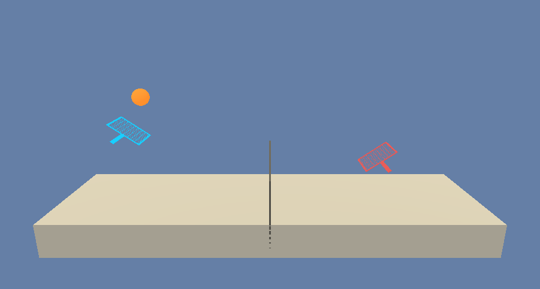
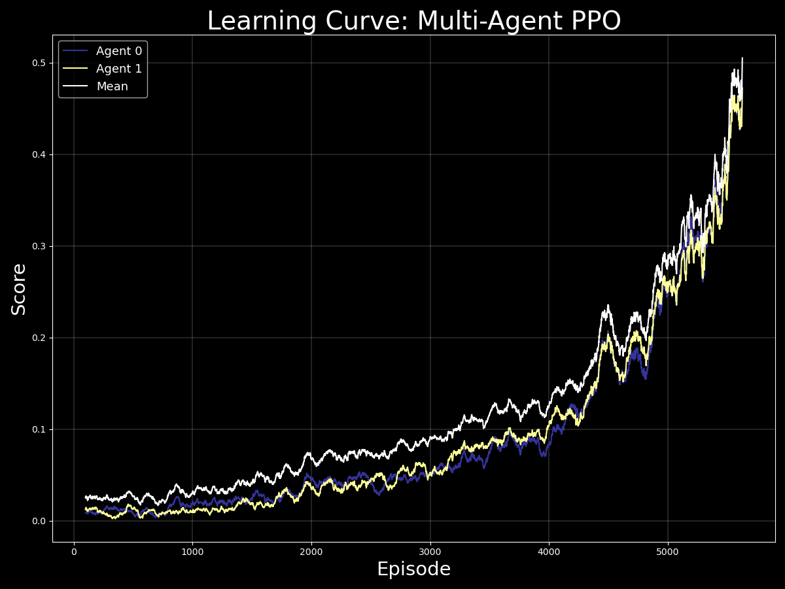

# Aprendizado por Reforço Competitivo através da Otimização de Políticas Proximais Multi-Agente

A oportunidade de avaliar as próprias habilidades em busca de conquistas por meio da competição é algo fascinante. Quem não aprecia a chance de desafiar amigos em um jogo justo de vez em quando? Pessoalmente, gosto muito do desafio de um jogo de basquete um a um, de relembrar bons momentos tentando vencer um antigo jogo de Nintendo 64, ou até mesmo de ter uma noite de jogos de tabuleiro com boa companhia. O processo de aprimorar continuamente o desempenho ao longo do tempo é complexo e prazeroso, sendo alcançado por meio de repetição, avaliação e aplicação de insights para modificar a abordagem.

E se esse processo pudesse ser implementado com Inteligência Artificial? Poderíamos usar experiência, avaliação e otimização de políticas para treinar um agente a se destacar em um domínio competitivo específico? Este repositório contém uma implementação de um algoritmo de IA voltado exatamente para esse objetivo.

## Detalhes

A implementação mencionada utiliza um algoritmo de Otimização de Políticas Proximais Multi-Agente (MAPPO) para desenvolver a habilidade de agentes em jogar tênis! Esse algoritmo pode ser aplicado em diversos domínios e é eficaz na criação de uma metodologia ideal para maximizar recompensas.

A abordagem se baseia na potência das redes Actor-Critic para otimizar uma política e alcançar expertise em um domínio pré-definido. O processo começa sem conhecimento sobre quais ações levariam a resultados positivos ou negativos; o algoritmo inicialmente amostra e avalia ações selecionadas de uma distribuição Gaussiana não otimizada. Após várias iterações, a rede Crítica avalia efetivamente os resultados de cada ação e fornece informações valiosas ao Ator, permitindo que ele otimize sua distribuição de amostragem de ações, resultando em um melhor desempenho no jogo!

No ambiente, o espaço de estados é composto por 8 variáveis que correspondem à posição e velocidade da bola e da raquete. O espaço de ações consiste em 2 ações contínuas: mover-se em direção ou afastar-se da rede e pular. Um agente ganha uma recompensa de +0.1 cada vez que consegue passar a bola por cima da rede. Se o agente deixar a bola tocar o chão ou se acertar a bola para fora, recebe uma penalização de -0.01. Essa abordagem de alocação de pontuação promove o objetivo geral de manter a bola em jogo. O ambiente é considerado resolvido quando a média da recompensa episódica máxima atinge +0.5 nos últimos 100 episódios.

 

  

 

## Resultados
No diretório saved_files, você encontrará os pesos do modelo salvo e gráficos da curva de aprendizado das redes Actor-Critic bem-sucedidas. Os agentes treinados conseguiram resolver o ambiente em 6.000 episódios utilizando o algoritmo de treinamento MAPPO. O gráfico abaixo mostra o desempenho dos agentes ao longo do tempo em termos de pontuação relativa média nos últimos 100 episódios.

 

  

 

## Dependências
In order to run the above code, you will have to set up and activate a customized Python 3.6 environment.  You may follow the directions [here](https://github.com/udacity/deep-reinforcement-learning#dependencies) for setup instructions.

Next, click the link corresponding to your operating system below which will download the respective UnityEnvironment.  You may then save the resulting file directly inside of your cloned repository in order to run the code.
* [Linux](https://s3-us-west-1.amazonaws.com/udacity-drlnd/P3/Tennis/Tennis_Linux.zip)
* [Mac OSX](https://s3-us-west-1.amazonaws.com/udacity-drlnd/P3/Tennis/Tennis.app.zip)
* [Windows (64-bit)](https://s3-us-west-1.amazonaws.com/udacity-drlnd/P3/Tennis/Tennis_Windows_x86_64.zip)

## Let's Play Tennis!
All of the relevant functionality and tools you will need in order to initialize and train the agents are available inside of this repository.  Please utilize the `run_tennis_main.py` file in order to run the training process.  If you would like to change any parameters to customize training, please update the relevant attributes in the function calls below the `if __name__ == '__main__':` block.
